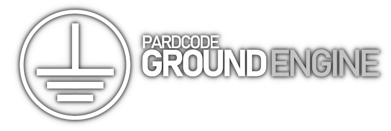

`Ground Engine` is an easy to use Game Engine Framework for 3D Game Development written in **C++**. 
It's currently under development and its creation will be documented through the YouTube Tutorial Series
[`Game Engine Development Series`](https://www.youtube.com/playlist?list=PLv8DnRaQOs5_doLZDgaBGociSUYGSg6rp). 

---

For any **questions**, **doubts** or **clarifications** about the usage or the development of `Ground Engine`, you can join
the [discord server](https://discord.gg/RymBzwKPyZ), where you can meet other users or developers like you. 
Before to ask any question, check the [FAQs]().
The answers you are searching for could be already there. 
Ground Engine Documentation will be created as the development proceeds. 
You can find the license [here](#license).

---

This project is available under a free and permissive license, but needs a financial support to sustain its development.  
The development includes both the making of video tutorials and the writing of the code.  
If this project is helpful to you, consider to support it through [`Patreon`](https://www.patreon.com/pardcode).   
Any single contribution would be greately appreciated, regardless the amount. 
Many thanks to all [**these people**](#supporters) who have supported me so far!

  

# Supporters

Thank you so much for your huge support!

**Patreon Supporters (alphabetical order)**  

Adam L. - Ahmad A. - Alex G. - Andrey G. - Andrew C. - Andrew M. - Anotherbear Gamer - Asterot13 - Austin M. 
Bastien R. - bdfy - Biuret - Carlo S. - Daniel W. - Edward T.O. - Elite Salad - EthanEdits - Guarded - hisuzuki 
Howl C - James B. - JaviFML - Jesse M.C. - Jonas F. - Joshua v. - Kim W. - kuronk cat - Lie - Mackay N. - Manuel H. 
Mateusz P. - Matthew - Michael W. - Miles H. - Mohammed A. - Murdo M. - Nikhil R. - Neil W. - Oliver H. - Otturd 
Patrick B. - Patrick L. - Ridtichai B. - Rem saigao - REX Li - Robson - SleepingDog - Slotho - Snip - Squeegiefilms 
Tatsuya - Tentacle Princess - The Spygineer - The Tutorial Chef - TheDevUK - Tim. A. - Tom L.Valgard 
Werner O. - WyattFlash 

**All YouTube - Discord - GitHub - Twitter - Facebook followers and viewers**  

P.S.: If you are a Patron and you want to be added/removed to/from this list,
please send a message to PardCode through Patreon.

# License

The license of this project is based on the modified BSD License.

That means you can do whatever you want with the code available in this repository. 
The only conditions to meet are:

    1. Redistributions of source code must retain the above copyright notice, this list of conditions and the following disclaimer.
    2. Redistributions in binary form must reproduce the above copyright notice, this list of conditions and the following disclaimer in the documentation and/or other materials provided with the distribution.

The license text is available in the [`LICENSE`](https://github.com/PardCode/GroundEngine/blob/master/LICENSE) file.
